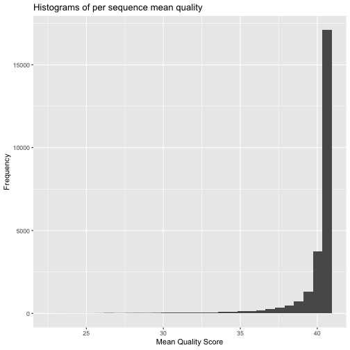
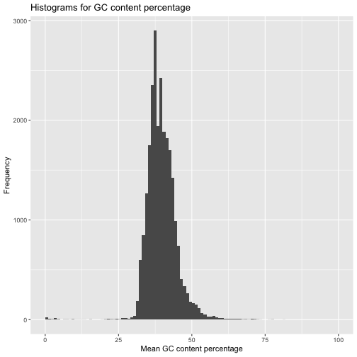
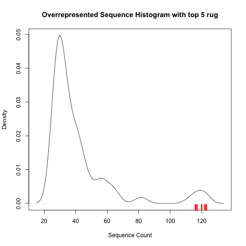
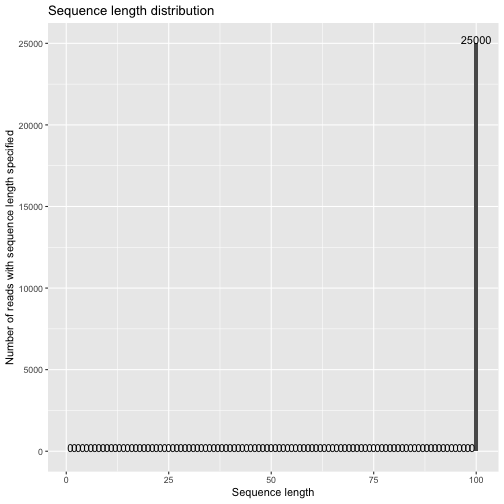
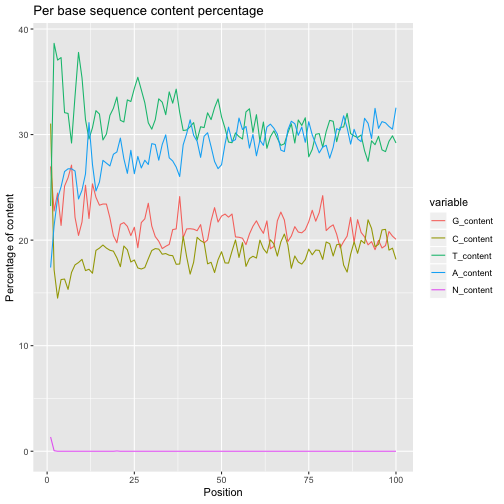
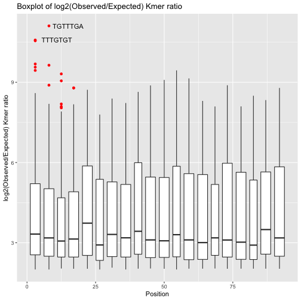

# Introduction

`qckitfastq` is part of the `qckit` suite of packages, the description of which can be found at
[http://compbiocore.github.io/qckit](http://compbiocore.github.io/qckit). The purpose of this particular
package is to run quality control on FASTQ files from genome sequencing.

## Why use qckitfastq?

Indeed there are many other quality control packages for FASTQ files existing already, including ShortReads [@shortread] and seqTools [@seqtools] for R and the popular FASTQC [@Andrews2010] Java-based program. qckitfastq offers a few advantages compared to these 3 programs for users who need such features:

  1. access to raw sequence and quality data
  2. access to data frames of the quality control results in addition to plots
  3. quality control analyses of the entire FASTQ file
  4. fast file processing
  
To break it down further, seqTools and ShortReads do not offer as comprehensive set of quality control metrics as qckitfastq and FASTQC. seqTools further provides limited access to raw data and intermediate analysis results. ShortRead provides users with access to the raw sequencing data and intermedite analysis results, but is inefficient on datasets exceeding 10 million reads. FASTQC meanwhile truncates any reads longer than 75bp as well as estimates overall quality only based on the first 100,000 reads of any FASTQ file. `qckitfastq` does not contain any of these limitations.


## Planned improvements

As is described on the [qckit project page](http://compbiocore.github.io/qckit), the long-term goal of the qckit suite is to not only provide comprehensive quality control metrics for common genomics sequencing workflows, but to 1) also provide quality control visualizations for multiple samples through updated modules in multiQC [@Ewels2016], and 2) provide a public quality control database which allows benchmarking of QC metrics for an experiment against other similar experiments. Users of `qckitfastq` will have the option to enter SRA metadata and create visualizations from our database as well as submit their qc results (if submitting an SRA archive) to our database once these features have been implemented.

# Running qckitfastq

`qckitfastq` provides the following metrics:

  * Read length distribution
  * Per base sequence quality
  * Per read sequence quality
  * GC content
  * Nucleotide sequence content
  * Kmer count
  * Overrepresented kmers
  * Overrepresented sequences

The simplest way to run `qckitfastq` is by executing `run_all`, a single command that will produce a report of all of the included metrics in a user-provided directory with some default parameters. However, each metric can also be run separately for closer examination.

# Individual metrics

Our example in this vignette has 25,000 reads, each 100bp long. The majority of metrics are run on the path to the FASTQ file. Some functions for quality control in this package are simply wrappers around `seqTools` due to the fact that their functions are fast. We provide these wrappers for the sake of completeness in quality control metrics. These wrappers require processing the FASTQ data through the `seqTools::fastqq` command first:

```r
library(qckitfastq)
```

```
## No methods found in package 'dplyr' for request: 'count' when loading 'qckitfastq'
```

```r
infile <- system.file("extdata", "10^5_reads_test.fq.gz", package = "qckitfastq")
fseq <- seqTools::fastqq(infile)
```

```
## [fastqq] File ( 1/1) '/Library/Frameworks/R.framework/Versions/3.5/Resources/library/qckitfastq/extdata/10^5_reads_test.fq.gz'	done.
```

### Basic metrics

After pre-processing with `seqTools::fastqq` we provide some basic metrics such as the number of reads and number of positions under the function *dimensions*. Here the sample file has 25,000 reads and 100 positions. This allows us to examine whether the sequence lengths are uniform throughout the entire file. The results from this section are useful for certain analyses where dimensionality of data is important for calculation, such as *overrep_kmer*. 

```r
nc <- dimensions(fseq,"positions")
nc
```

```
## [1] 100
```

```r
nr <- dimensions(fseq,"reads")
nr
```

```
## [1] 25000
```

The rest of this vignette will be divided into functions that make use of `seqTools::fastqq` and those that use more customized C++ code.

## C++ based metrics

### Per base quality score

The *per_base_quality* function calculates quality score per base summary statistics of 10th, 25th, median, 75th and 90th quantiles across sequences. Currently it treats all quality score encodings as Phred+33. We can use the result to create a quality score distribution per position plot. As a basic heuristic, quality scores above 28 can be categorized as good (green), those from 20 to 28 can be categorized as medium (yellow), and under 20 is bad (red).


```r
bs <- per_base_quality(infile)
knitr::kable(head(bs))
```

<table>
 <thead>
  <tr>
   <th style="text-align:right;"> q10 </th>
   <th style="text-align:right;"> q25 </th>
   <th style="text-align:right;"> median </th>
   <th style="text-align:right;"> q75 </th>
   <th style="text-align:right;"> q90 </th>
  </tr>
 </thead>
<tbody>
  <tr>
   <td style="text-align:right;"> 32 </td>
   <td style="text-align:right;"> 32 </td>
   <td style="text-align:right;"> 32 </td>
   <td style="text-align:right;"> 32 </td>
   <td style="text-align:right;"> 32 </td>
  </tr>
  <tr>
   <td style="text-align:right;"> 32 </td>
   <td style="text-align:right;"> 32 </td>
   <td style="text-align:right;"> 32 </td>
   <td style="text-align:right;"> 32 </td>
   <td style="text-align:right;"> 32 </td>
  </tr>
  <tr>
   <td style="text-align:right;"> 32 </td>
   <td style="text-align:right;"> 37 </td>
   <td style="text-align:right;"> 37 </td>
   <td style="text-align:right;"> 37 </td>
   <td style="text-align:right;"> 37 </td>
  </tr>
  <tr>
   <td style="text-align:right;"> 37 </td>
   <td style="text-align:right;"> 37 </td>
   <td style="text-align:right;"> 37 </td>
   <td style="text-align:right;"> 37 </td>
   <td style="text-align:right;"> 37 </td>
  </tr>
  <tr>
   <td style="text-align:right;"> 37 </td>
   <td style="text-align:right;"> 37 </td>
   <td style="text-align:right;"> 37 </td>
   <td style="text-align:right;"> 37 </td>
   <td style="text-align:right;"> 37 </td>
  </tr>
  <tr>
   <td style="text-align:right;"> 37 </td>
   <td style="text-align:right;"> 41 </td>
   <td style="text-align:right;"> 41 </td>
   <td style="text-align:right;"> 41 </td>
   <td style="text-align:right;"> 41 </td>
  </tr>
</tbody>
</table>

```r
plot_per_base_quality(bs)
```


### Per read sequence quality score

The *plot_perseq_quality* function extracts the mean quality score per read and generate a histogram of this statistics. The histogram would be considered an indication of good data quality when the majority of reads have mean quality scores greater than 30. If a significant portion of reads have quality scores less than 30, then the data most likely has issues that need to be examined.


```r
plot_perseq_quality(infile)
```



### GC content

The *GC_content* function computes the GC nucleotide content percentage per read, and *plot_GC_content* plots the distribution of GC content. As a general rule, an indication of good data quality is when the GC content percentage in each read is between 30 and 50% and roughly follows a normal distribution.


```r
gc_df <- GC_content(infile)
knitr::kable(head(gc_df))
```

<table>
 <thead>
  <tr>
   <th style="text-align:right;"> meanGC </th>
  </tr>
 </thead>
<tbody>
  <tr>
   <td style="text-align:right;"> 43 </td>
  </tr>
  <tr>
   <td style="text-align:right;"> 37 </td>
  </tr>
  <tr>
   <td style="text-align:right;"> 39 </td>
  </tr>
  <tr>
   <td style="text-align:right;"> 40 </td>
  </tr>
  <tr>
   <td style="text-align:right;"> 42 </td>
  </tr>
  <tr>
   <td style="text-align:right;"> 38 </td>
  </tr>
</tbody>
</table>

```r
plot_GC_content(nc,gc_df)
```



### Overrepresented sequences

Taking in the output generated from *cal_over_rep_seq*, function *overrepresented_sequence* produce the overrepresented sequence table by selecting the unique sequences that have counts larger than 0.1% of the total reads of the data file. The results would be displayed as table with decreasing order of counts. Function *overrepresented_plot* would take the overrepresented sequence table as input and present a density plot of the counts and mark the top 5 overrepresented sequence in red. 


```r
overrep_seq<-overrep_sequence(infile,nr)
knitr::kable(head(overrep_sequence,n = 5))
```

<table>
 <thead>
  <tr>
   <th style="text-align:left;">  </th>
  </tr>
 </thead>
<tbody>
  <tr>
   <td style="text-align:left;"> function (infile, nr, output_file = NA) </td>
  </tr>
  <tr>
   <td style="text-align:left;"> { </td>
  </tr>
  <tr>
   <td style="text-align:left;"> over_rep &lt;- calc_over_rep_seq(infile) </td>
  </tr>
  <tr>
   <td style="text-align:left;"> over_rep_table &lt;- over_rep[over_rep &gt; 0.001 * nr] </td>
  </tr>
  <tr>
   <td style="text-align:left;"> overrep_order &lt;- sort(over_rep_table, decreasing = TRUE) </td>
  </tr>
</tbody>
</table>

```r
plot_overrep_seq(overrep_seq)
```




## seqTools::fastqq based metrics

*plot_read_length* generates a distribution plot of the length of all reads. The generated plot would show the sequence length of all the sequences throughout the file. The plot is considered an indication of good data quality is all sequences have the same sequence length with no deviations. The following plot shows that all reads in the file have sequence length of 100.


```r
plot_read_length(fseq)
```



### Nucleotide sequence content

*sequence_content* calculates the total number of each nucleotide sequence content per sequence throughout the file. *plot_sequence_conent* uses the *sequence_content* function and plots the percentage of all nucleotide sequence content per position. As a general rule, the plot would be considered an indication of good data quality when the percentage of each nucleotide sequence content is about evenly distributed across all bases. However, there are some types of analyses for which this will not be the case. For example, RNA-Seq will have an uneven sequence content distribution in the first 10 bases, and RRBS will have almost no cytosines and very high thymine content because the library prep protocol converts most C to T. Knowledge of the library prep protocol is thus important for evaluating quality in terms of nucleotide sequence content.


```r
scA <- sequence_content(fseq, content = "A")
head(scA)
```

```
## [1] 4351 5341 5995 6262 6624 6689
```

```r
plot_sequence_content(fseq,nr,nc)
```

```
## No id variables; using all as measure variables
```



## Kmers count per base

*kmer_count* function produces the per position kmer count with given path to the FASTQ file and the kmer length specified. 


```r
km <- kmer_count(infile,k=6)
```

```
## [fastq_Klocs] File ( 1/1) '/Library/Frameworks/R.framework/Versions/3.5/Resources/library/qckitfastq/extdata/10^5_reads_test.fq.gz' 	done.
```

```r
knitr::kable(km[1:20,1:10])
```

<table>
 <thead>
  <tr>
   <th style="text-align:left;">   </th>
   <th style="text-align:right;"> 1 </th>
   <th style="text-align:right;"> 2 </th>
   <th style="text-align:right;"> 3 </th>
   <th style="text-align:right;"> 4 </th>
   <th style="text-align:right;"> 5 </th>
   <th style="text-align:right;"> 6 </th>
   <th style="text-align:right;"> 7 </th>
   <th style="text-align:right;"> 8 </th>
   <th style="text-align:right;"> 9 </th>
   <th style="text-align:right;"> 10 </th>
  </tr>
 </thead>
<tbody>
  <tr>
   <td style="text-align:left;"> AAAAAA </td>
   <td style="text-align:right;"> 14 </td>
   <td style="text-align:right;"> 9 </td>
   <td style="text-align:right;"> 44 </td>
   <td style="text-align:right;"> 18 </td>
   <td style="text-align:right;"> 33 </td>
   <td style="text-align:right;"> 42 </td>
   <td style="text-align:right;"> 69 </td>
   <td style="text-align:right;"> 163 </td>
   <td style="text-align:right;"> 41 </td>
   <td style="text-align:right;"> 34 </td>
  </tr>
  <tr>
   <td style="text-align:left;"> AAAAAC </td>
   <td style="text-align:right;"> 8 </td>
   <td style="text-align:right;"> 4 </td>
   <td style="text-align:right;"> 1 </td>
   <td style="text-align:right;"> 24 </td>
   <td style="text-align:right;"> 2 </td>
   <td style="text-align:right;"> 9 </td>
   <td style="text-align:right;"> 21 </td>
   <td style="text-align:right;"> 14 </td>
   <td style="text-align:right;"> 142 </td>
   <td style="text-align:right;"> 5 </td>
  </tr>
  <tr>
   <td style="text-align:left;"> AAAAAG </td>
   <td style="text-align:right;"> 2 </td>
   <td style="text-align:right;"> 2 </td>
   <td style="text-align:right;"> 0 </td>
   <td style="text-align:right;"> 3 </td>
   <td style="text-align:right;"> 2 </td>
   <td style="text-align:right;"> 3 </td>
   <td style="text-align:right;"> 2 </td>
   <td style="text-align:right;"> 2 </td>
   <td style="text-align:right;"> 1 </td>
   <td style="text-align:right;"> 1 </td>
  </tr>
  <tr>
   <td style="text-align:left;"> AAAAAT </td>
   <td style="text-align:right;"> 8 </td>
   <td style="text-align:right;"> 28 </td>
   <td style="text-align:right;"> 29 </td>
   <td style="text-align:right;"> 34 </td>
   <td style="text-align:right;"> 44 </td>
   <td style="text-align:right;"> 34 </td>
   <td style="text-align:right;"> 33 </td>
   <td style="text-align:right;"> 65 </td>
   <td style="text-align:right;"> 28 </td>
   <td style="text-align:right;"> 58 </td>
  </tr>
  <tr>
   <td style="text-align:left;"> AAAACA </td>
   <td style="text-align:right;"> 0 </td>
   <td style="text-align:right;"> 2 </td>
   <td style="text-align:right;"> 5 </td>
   <td style="text-align:right;"> 4 </td>
   <td style="text-align:right;"> 4 </td>
   <td style="text-align:right;"> 3 </td>
   <td style="text-align:right;"> 4 </td>
   <td style="text-align:right;"> 6 </td>
   <td style="text-align:right;"> 3 </td>
   <td style="text-align:right;"> 3 </td>
  </tr>
  <tr>
   <td style="text-align:left;"> AAAACC </td>
   <td style="text-align:right;"> 2 </td>
   <td style="text-align:right;"> 8 </td>
   <td style="text-align:right;"> 4 </td>
   <td style="text-align:right;"> 1 </td>
   <td style="text-align:right;"> 25 </td>
   <td style="text-align:right;"> 2 </td>
   <td style="text-align:right;"> 9 </td>
   <td style="text-align:right;"> 21 </td>
   <td style="text-align:right;"> 15 </td>
   <td style="text-align:right;"> 143 </td>
  </tr>
  <tr>
   <td style="text-align:left;"> AAAACG </td>
   <td style="text-align:right;"> 1 </td>
   <td style="text-align:right;"> 2 </td>
   <td style="text-align:right;"> 2 </td>
   <td style="text-align:right;"> 0 </td>
   <td style="text-align:right;"> 0 </td>
   <td style="text-align:right;"> 1 </td>
   <td style="text-align:right;"> 2 </td>
   <td style="text-align:right;"> 0 </td>
   <td style="text-align:right;"> 2 </td>
   <td style="text-align:right;"> 2 </td>
  </tr>
  <tr>
   <td style="text-align:left;"> AAAACT </td>
   <td style="text-align:right;"> 0 </td>
   <td style="text-align:right;"> 2 </td>
   <td style="text-align:right;"> 1 </td>
   <td style="text-align:right;"> 2 </td>
   <td style="text-align:right;"> 4 </td>
   <td style="text-align:right;"> 3 </td>
   <td style="text-align:right;"> 0 </td>
   <td style="text-align:right;"> 2 </td>
   <td style="text-align:right;"> 3 </td>
   <td style="text-align:right;"> 0 </td>
  </tr>
  <tr>
   <td style="text-align:left;"> AAAAGA </td>
   <td style="text-align:right;"> 0 </td>
   <td style="text-align:right;"> 0 </td>
   <td style="text-align:right;"> 0 </td>
   <td style="text-align:right;"> 1 </td>
   <td style="text-align:right;"> 1 </td>
   <td style="text-align:right;"> 2 </td>
   <td style="text-align:right;"> 1 </td>
   <td style="text-align:right;"> 1 </td>
   <td style="text-align:right;"> 1 </td>
   <td style="text-align:right;"> 0 </td>
  </tr>
  <tr>
   <td style="text-align:left;"> AAAAGC </td>
   <td style="text-align:right;"> 1 </td>
   <td style="text-align:right;"> 3 </td>
   <td style="text-align:right;"> 1 </td>
   <td style="text-align:right;"> 0 </td>
   <td style="text-align:right;"> 0 </td>
   <td style="text-align:right;"> 1 </td>
   <td style="text-align:right;"> 2 </td>
   <td style="text-align:right;"> 0 </td>
   <td style="text-align:right;"> 3 </td>
   <td style="text-align:right;"> 4 </td>
  </tr>
  <tr>
   <td style="text-align:left;"> AAAAGG </td>
   <td style="text-align:right;"> 3 </td>
   <td style="text-align:right;"> 4 </td>
   <td style="text-align:right;"> 7 </td>
   <td style="text-align:right;"> 2 </td>
   <td style="text-align:right;"> 3 </td>
   <td style="text-align:right;"> 3 </td>
   <td style="text-align:right;"> 3 </td>
   <td style="text-align:right;"> 3 </td>
   <td style="text-align:right;"> 7 </td>
   <td style="text-align:right;"> 4 </td>
  </tr>
  <tr>
   <td style="text-align:left;"> AAAAGT </td>
   <td style="text-align:right;"> 0 </td>
   <td style="text-align:right;"> 2 </td>
   <td style="text-align:right;"> 2 </td>
   <td style="text-align:right;"> 2 </td>
   <td style="text-align:right;"> 1 </td>
   <td style="text-align:right;"> 0 </td>
   <td style="text-align:right;"> 2 </td>
   <td style="text-align:right;"> 2 </td>
   <td style="text-align:right;"> 3 </td>
   <td style="text-align:right;"> 0 </td>
  </tr>
  <tr>
   <td style="text-align:left;"> AAAATA </td>
   <td style="text-align:right;"> 6 </td>
   <td style="text-align:right;"> 6 </td>
   <td style="text-align:right;"> 24 </td>
   <td style="text-align:right;"> 11 </td>
   <td style="text-align:right;"> 6 </td>
   <td style="text-align:right;"> 9 </td>
   <td style="text-align:right;"> 18 </td>
   <td style="text-align:right;"> 17 </td>
   <td style="text-align:right;"> 10 </td>
   <td style="text-align:right;"> 29 </td>
  </tr>
  <tr>
   <td style="text-align:left;"> AAAATC </td>
   <td style="text-align:right;"> 1 </td>
   <td style="text-align:right;"> 0 </td>
   <td style="text-align:right;"> 2 </td>
   <td style="text-align:right;"> 0 </td>
   <td style="text-align:right;"> 2 </td>
   <td style="text-align:right;"> 0 </td>
   <td style="text-align:right;"> 0 </td>
   <td style="text-align:right;"> 3 </td>
   <td style="text-align:right;"> 2 </td>
   <td style="text-align:right;"> 1 </td>
  </tr>
  <tr>
   <td style="text-align:left;"> AAAATG </td>
   <td style="text-align:right;"> 0 </td>
   <td style="text-align:right;"> 3 </td>
   <td style="text-align:right;"> 0 </td>
   <td style="text-align:right;"> 0 </td>
   <td style="text-align:right;"> 1 </td>
   <td style="text-align:right;"> 2 </td>
   <td style="text-align:right;"> 1 </td>
   <td style="text-align:right;"> 2 </td>
   <td style="text-align:right;"> 3 </td>
   <td style="text-align:right;"> 3 </td>
  </tr>
  <tr>
   <td style="text-align:left;"> AAAATT </td>
   <td style="text-align:right;"> 9 </td>
   <td style="text-align:right;"> 6 </td>
   <td style="text-align:right;"> 32 </td>
   <td style="text-align:right;"> 28 </td>
   <td style="text-align:right;"> 31 </td>
   <td style="text-align:right;"> 42 </td>
   <td style="text-align:right;"> 32 </td>
   <td style="text-align:right;"> 32 </td>
   <td style="text-align:right;"> 65 </td>
   <td style="text-align:right;"> 27 </td>
  </tr>
  <tr>
   <td style="text-align:left;"> AAACAA </td>
   <td style="text-align:right;"> 0 </td>
   <td style="text-align:right;"> 1 </td>
   <td style="text-align:right;"> 3 </td>
   <td style="text-align:right;"> 0 </td>
   <td style="text-align:right;"> 6 </td>
   <td style="text-align:right;"> 1 </td>
   <td style="text-align:right;"> 1 </td>
   <td style="text-align:right;"> 3 </td>
   <td style="text-align:right;"> 3 </td>
   <td style="text-align:right;"> 0 </td>
  </tr>
  <tr>
   <td style="text-align:left;"> AAACAC </td>
   <td style="text-align:right;"> 2 </td>
   <td style="text-align:right;"> 3 </td>
   <td style="text-align:right;"> 1 </td>
   <td style="text-align:right;"> 5 </td>
   <td style="text-align:right;"> 3 </td>
   <td style="text-align:right;"> 4 </td>
   <td style="text-align:right;"> 4 </td>
   <td style="text-align:right;"> 4 </td>
   <td style="text-align:right;"> 2 </td>
   <td style="text-align:right;"> 3 </td>
  </tr>
  <tr>
   <td style="text-align:left;"> AAACAG </td>
   <td style="text-align:right;"> 5 </td>
   <td style="text-align:right;"> 0 </td>
   <td style="text-align:right;"> 1 </td>
   <td style="text-align:right;"> 4 </td>
   <td style="text-align:right;"> 4 </td>
   <td style="text-align:right;"> 1 </td>
   <td style="text-align:right;"> 3 </td>
   <td style="text-align:right;"> 0 </td>
   <td style="text-align:right;"> 2 </td>
   <td style="text-align:right;"> 1 </td>
  </tr>
  <tr>
   <td style="text-align:left;"> AAACAT </td>
   <td style="text-align:right;"> 2 </td>
   <td style="text-align:right;"> 1 </td>
   <td style="text-align:right;"> 3 </td>
   <td style="text-align:right;"> 4 </td>
   <td style="text-align:right;"> 1 </td>
   <td style="text-align:right;"> 2 </td>
   <td style="text-align:right;"> 0 </td>
   <td style="text-align:right;"> 0 </td>
   <td style="text-align:right;"> 3 </td>
   <td style="text-align:right;"> 3 </td>
  </tr>
</tbody>
</table>

## Overrepresented kmers

The function generates list of overrepresented kmers with its maximum log2(observed/expected) ratio and the position of the maximum obs/exp ratio in descending order. Only those kmers with a ratio greater than 2 are returned in the data frame. We can also create a boxplot of the obs/exp ratio thatn includes plotting the top 2 (or n) kmer outliers.


```r
overkm <-overrep_kmer(infile,7,nc,nr)
```

```
## [fastqq] File ( 1/1) '/Library/Frameworks/R.framework/Versions/3.5/Resources/library/qckitfastq/extdata/10^5_reads_test.fq.gz'	done.
## [fastq_Klocs] File ( 1/1) '/Library/Frameworks/R.framework/Versions/3.5/Resources/library/qckitfastq/extdata/10^5_reads_test.fq.gz' 	done.
```

```r
knitr::kable(head(overkm,n=10))
```

<table>
 <thead>
  <tr>
   <th style="text-align:right;"> row </th>
   <th style="text-align:right;"> pos </th>
   <th style="text-align:right;"> obsexp_ratio </th>
   <th style="text-align:left;"> kmer </th>
  </tr>
 </thead>
<tbody>
  <tr>
   <td style="text-align:right;"> 15353 </td>
   <td style="text-align:right;"> 6 </td>
   <td style="text-align:right;"> 11.109619 </td>
   <td style="text-align:left;"> TGTTTGA </td>
  </tr>
  <tr>
   <td style="text-align:right;"> 16316 </td>
   <td style="text-align:right;"> 2 </td>
   <td style="text-align:right;"> 10.580131 </td>
   <td style="text-align:left;"> TTTGTGT </td>
  </tr>
  <tr>
   <td style="text-align:right;"> 8175 </td>
   <td style="text-align:right;"> 1 </td>
   <td style="text-align:right;"> 10.552171 </td>
   <td style="text-align:left;"> CTTTGTG </td>
  </tr>
  <tr>
   <td style="text-align:right;"> 12031 </td>
   <td style="text-align:right;"> 5 </td>
   <td style="text-align:right;"> 9.685497 </td>
   <td style="text-align:left;"> GTGTTTG </td>
  </tr>
  <tr>
   <td style="text-align:right;"> 12259 </td>
   <td style="text-align:right;"> 7 </td>
   <td style="text-align:right;"> 9.638035 </td>
   <td style="text-align:left;"> GTTTGAG </td>
  </tr>
  <tr>
   <td style="text-align:right;"> 15296 </td>
   <td style="text-align:right;"> 4 </td>
   <td style="text-align:right;"> 9.565904 </td>
   <td style="text-align:left;"> TGTGTTT </td>
  </tr>
  <tr>
   <td style="text-align:right;"> 8066 </td>
   <td style="text-align:right;"> 56 </td>
   <td style="text-align:right;"> 9.445229 </td>
   <td style="text-align:left;"> CTTGAAC </td>
  </tr>
  <tr>
   <td style="text-align:right;"> 16112 </td>
   <td style="text-align:right;"> 3 </td>
   <td style="text-align:right;"> 9.444925 </td>
   <td style="text-align:left;"> TTGTGTT </td>
  </tr>
  <tr>
   <td style="text-align:right;"> 12108 </td>
   <td style="text-align:right;"> 13 </td>
   <td style="text-align:right;"> 9.314122 </td>
   <td style="text-align:left;"> GTTCAGT </td>
  </tr>
  <tr>
   <td style="text-align:right;"> 2553 </td>
   <td style="text-align:right;"> 54 </td>
   <td style="text-align:right;"> 9.278962 </td>
   <td style="text-align:left;"> AGCTTGA </td>
  </tr>
</tbody>
</table>

```r
plot_overrep_kmer(overkm)
```


